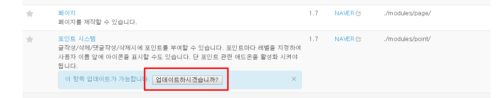

# xe.1.8.24-point

포인트 적립을 하기 위해서  게시판 및 댓글 도배 시도를 방지하기 위해서, 
기본 Point 모듈에서 하루 1회씩만 게시글 및 댓글에 포인트 적립하게 수정함.

### 1. /XEHOME/module/point 폴더에 소스를 복사

Web hosting server 에 접속한 후에 다음 명령어를 실행합니다.

```sh
$ cd /your_www_home/xe_home/modules/point/
$ wget https://github.com/spidersonthenetwork/xe.1.8.24-point/archive/master.zip
$ unzip master.zip
$ cp -R xe.1.8.24-point-master/* .
$ rm -rf xe.1.8.24-point-master/ master.zip 
```

### 2. admin으로 로그인 후, 모듈 리스트에서 포인트 모듈 '업데이트' - DB 칼럼 추가(extra_vars 칼럼)



### 3. Enjoy


만약을 대비해 기존 소스 백업 및 DB 백업은 기본!

아직까지 알려진 버그나 문제는 없습니다.

하지만, 본소스로 발생하는 문제에 대해서 본인은 책임이 없습니다.

소스 변경 부분을 확인하기 위해서, 소스 리스트에서 '게시글 및 댓글 포인트 하루 1회로 제한' 을 클릭하시면, 변경된 부분을 비교 하실 수 있습니다.


